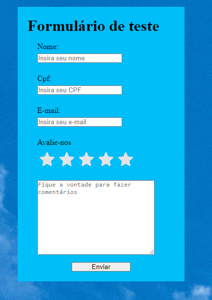

# Form
## Descrição do Projeto: 
Basicamente um formulário onde o usuário insere algumas informações, resolvi fazer o upload por conta de algumas validações utilizadas que podem ser úteis.

## Tecnologias usadas
- JavaScript: para o gerenciamento e validação dos dados.
- HTML: Para marcação;
- CSS: Para estilização;

## Como Usar
- Faça o download do repositório ou clone para sua maquina
- Abra o aplicativo em um navegador da web

## Autor
- Eu :)

